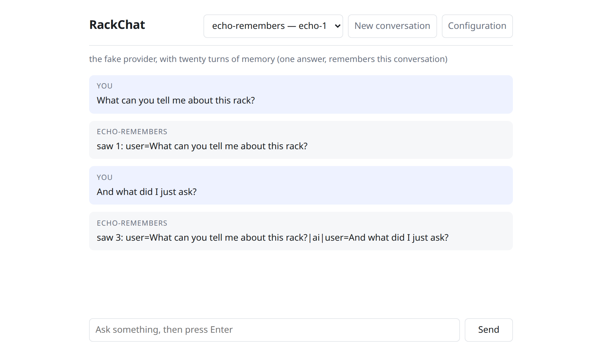
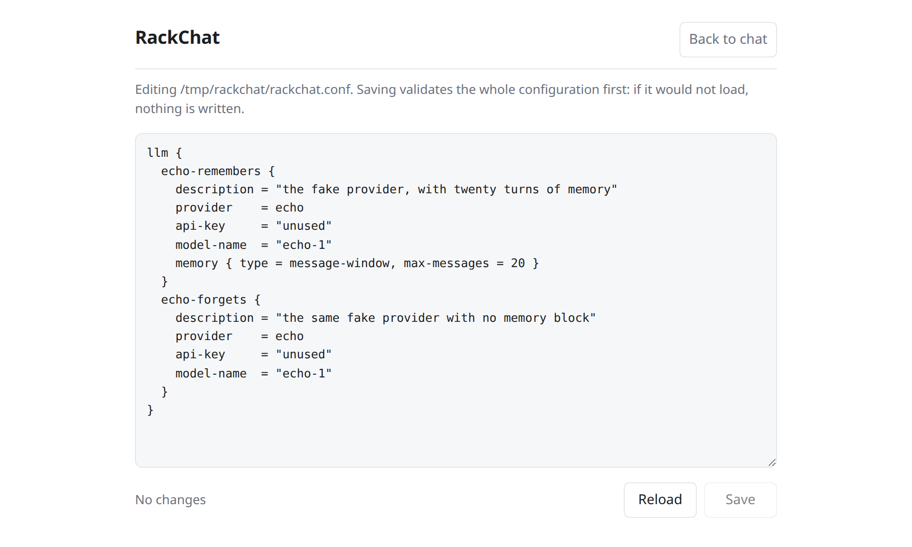

# RackChat

[](https://github.com/maxtrezzi/rackchat/actions/workflows/build.yml)
[](LICENSE)

A web application to chat with large language models (LLM), built on
[modelrack4j](https://github.com/maxtrezzi/modelrack4j) and LangChain4j.

The connections you can talk to are not hard-coded: they come from a modelrack4j
configuration file, one block per connection. The page shows them in a selector, streams the
answer as it arrives, and lets you edit that file in a second tab. Edits take effect without
a restart — whether you make them in the page or in the file itself. A change that would not
load is refused before anything is written.

A connection with a `memory` block holds a conversation: follow-up questions carry what was
said before, within the window the configuration sets. One without it answers each question on
its own, and the page says so under the selector.

```
llm {
  fast {
    description = "quick answers, streamed"
    provider    = openai
    api-key     = ${OPENAI_API_KEY}
    model-name  = "gpt-5.1"
    streaming   = true
    memory { type = message-window, max-messages = 20 }
  }
}
```



*Answered by the fake provider that ships in the test sources, which replies with a description
of the messages it was given — `saw 3: …` is the second question arriving with the first
exchange still in front of it. It is how you can try the whole application with no account at
all, and the only way to watch memory from outside.*

The second tab is the configuration file itself. Saving parses and publishes the whole thing
first: text that would not load is refused with the reason, and the file on disk is left
untouched.



## Running it

Java 21 and Maven; everything else comes from Maven Central. Copy
`backend/rackchat.example.conf`, fill in the environment variables it names, and start it:

```bash
git clone https://github.com/maxtrezzi/rackchat
cd rackchat/backend
cp rackchat.example.conf rackchat.conf
OPENAI_API_KEY=... ./run.sh rackchat.conf
```

Then open <http://127.0.0.1:7070/>. `run.sh` compiles and starts; its arguments are RackChat's
own. `mvn verify` runs the 28 tests, which need neither a key nor a network connection.

**[`docs/running-locally.md`](docs/running-locally.md) is the full version**: what to check
first, what each setting does, how to try the whole application with no API key at all, and
what the common failures look like.

## Before you expose it

**The server binds `127.0.0.1`, and nothing here authenticates.** The configuration tab serves
the configuration file's raw text to whoever reaches the page — with `api-key = ${OPENAI_API_KEY}`
that is a variable's name, and with a literal key pasted into the file it is the key. The
loopback default is what stands between that and the network.

`RACKCHAT_HOST` moves the bind address. Read
[ADR-0010](docs/adr/0010-edit-the-raw-hocon-in-a-textarea.md) before you use it: moving it
without solving authentication puts the configuration, and anything literal in it, in front of
everyone who can reach the port.

## One thing nobody has checked

**No part of this project has ever exchanged a message with a real model.** It was built on a
machine with no provider key and no route to the providers, so every path was exercised except
the one where tokens actually arrive. What *was* seen is the failure half: a provider error
reaching the browser as a clean `done` frame instead of a hang.

If you run this with a key and the token path misbehaves, that is the untested ground, and
[an issue](https://github.com/maxtrezzi/rackchat/issues) about it is worth more than one about
anything else here.

## What is here

- `backend/` — the Javalin API and, inside its resources, the Hyperapp page it serves.
- [`docs/running-locally.md`](docs/running-locally.md) — how to run it from a fresh checkout.
- `docs/adr/` — why the project is shaped this way, with the alternatives that were rejected.
- `docs/tasks/` — what is done, what is next, and what each milestone actually found.
- [`AGENTS.md`](AGENTS.md) — the short version of what is load-bearing, for anyone changing it.
- [`CONTRIBUTING.md`](CONTRIBUTING.md) — issue first; the scope here is narrow.

## Licence

Apache-2.0 — see [`LICENSE`](LICENSE) and [`NOTICE`](NOTICE). The vendored
[Hyperapp](https://github.com/jorgebucaran/hyperapp) keeps its own MIT licence beside it in
`backend/src/main/resources/public/vendor/`.
